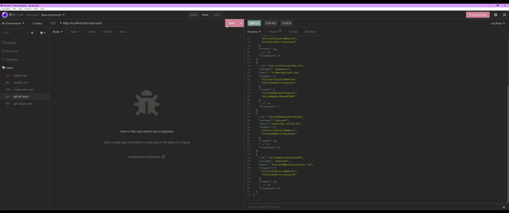
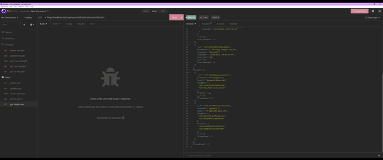
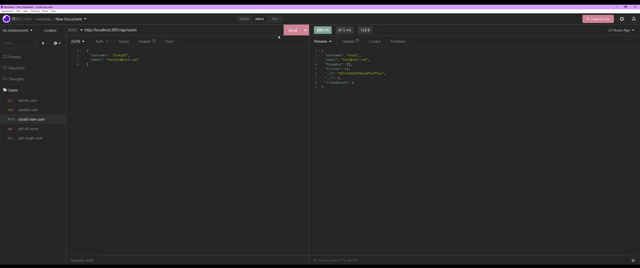
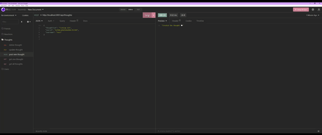
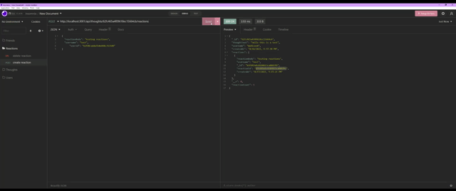
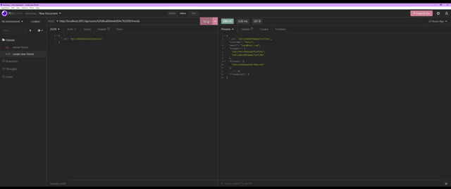

# Social-Network-API-NoSQL


## Summary

An API created for a social media network using MongoDB for a NoSQL database so that the website can handle large amounts of data.

## 📃 Table of Contents

* [Features](#features)
* [Installations](#installations)
* [Usage](#usage)
* [Mock-up](#mock-up)
* [Author](#author)

## ✨ Features

* Node.js
* Express.js
* MongoDB
* Insomnia

## ⚙ Installations

Mongoose - ODM library for MongoDB

```
npm i mongoose --save
```

## 👩🏻‍💻 Usage

When the server is started, the Mongoose models will be synced with the MongoDB database.
Routes available in Insomnia:

* API GET: get all users, get a single user, get all thoughts, and get a single thought.
* API POST: create new user, create new thought, create reaction to thought, and create new friend for user
* API PUT: update existing user, and update thought.
* API DELETE: delete single user, delete single thought, delete reaction, and delete friend.

**Additionally, the users associated thoughts will also be deleted when the user is deleted.

## 🖼 Mock Up

📹 [Walkthrough Video](https://drive.google.com/file/d/1JBrfKy6YljAnN12EzUUUkd6piHky2zwU/view?usp=sharing)

GET routes to return all users and all thoughts being tested in Insomnia:



GET routes to return a single user and a single thought:



POST, PUT, and DELETE routes for users:



POST, PUT, and DELETE routes for thoughts:



POST and DELETE routes for reactions to thoughts:



POST and DELETE routes for a user’s friend list:



### 👋 Author

Check out my [Github profile](https://github.com/rheangocle) if you are interested in seeing more. For questions, please email me at rheangocle@gmail.com.

---
Copyright © 2022 Rhea Le
Licensed under [MIT](License) license
